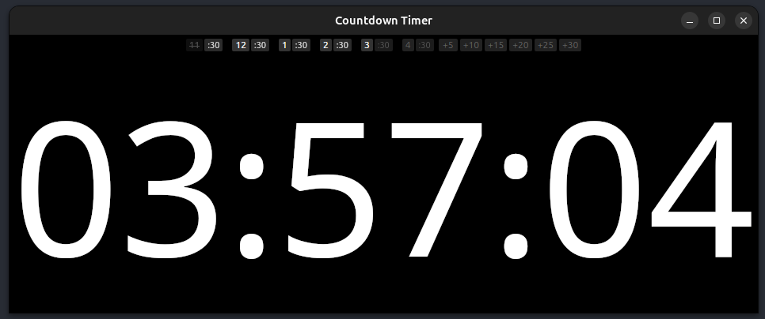

# Countdown Timer

A simple desktop countdown timer built with Tauri.



## Features
- Set countdown timers by hour/half-hour or minute increments
- Visual and audio alerts
- Cross-platform (Windows, macOS, Linux)

## Development
```bash
npm install
npm run tauri dev
```

## Build
```bash
npm run tauri build
```